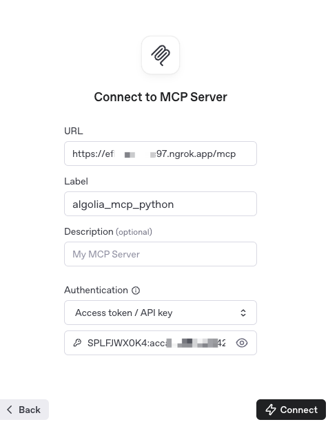
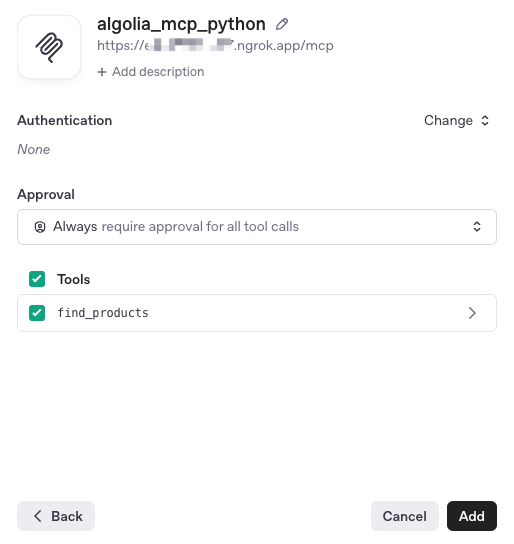
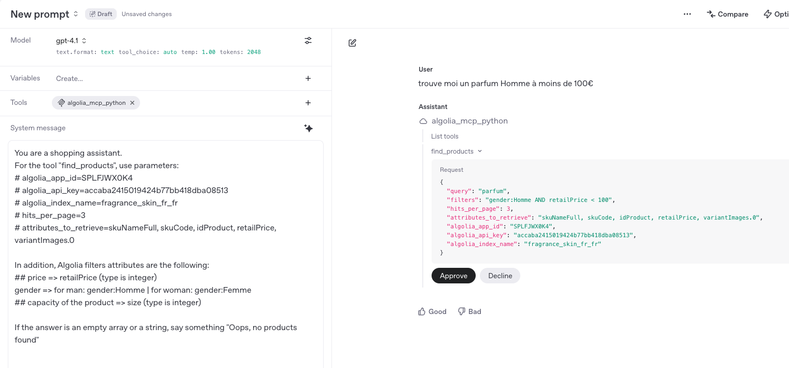

# Run Algolia Search MCP Server on ChatGPT / OpenAI

## Using Python on your machine

### Install

```shell
pip install -r requirements.txt
```

### Configuration

Add a .env file in the rood directory of the projet like:

```
MCP_HOST=127.0.0.1
MCP_PORT=8080
MCP_PATH=/mcp
MCP_TRANSPORT=http
MCP_LOG_LEVEL=info
```

### Run the MCP Server

```shell
fastmcp run server.py:mcp
```

### Introspect the MCP Server

```
npx @modelcontextprotocol/inspector
```

You can use it to test the connection with

- Transport Type: `Streamable HTTP`
- URL: `http://127.0.0.1:8080/mcp`
- Authentication: **API Key / Auth token**
  eg. Use your `APP_ID:API_KEY` like `SPLFJWX0K4:your_api_key`

Where host, port and path can be changed in the MCP Server config file (.env)

### Run ngrok for tunneling

```
ngrok http 8080
```

Nb: `8080` can be changed in the MCP Server config file (.env)

It will give you the HTTPS address to allow ChatGPT to connect to your local machine

### Add Algolia Search MCP Server to ChatGPT

1. Go to the ChatGPT Playground for prompts

   [https://platform.openai.com/playground/prompts](https://platform.openai.com/playground/prompts)

2. Add a new tool with the parameters:

- URL: ngrob provided URL + extension **/mcp**.

  Eg. [https://fe8c3a39cc68.ngrok.app/**mcp**](https://fe8c3a39cc68.ngrok.app/mcp)

- Label: **algolia_mcp_python**

  Nb: it could be anything

- Authentication: **API Key / Auth token**

eg. Use your `APP_ID:API_KEY` like `SPLFJWX0K4:your_api_key`



3. Connect
   It should list one tool => `find_products`

   

4. Configure the Algolia parameters and index specificity in the

```
You are a shopping assistant.

# MCP usage for tool: **find_products**
## System Parameters:
- algolia_index_name=fragrance_skin_fr_fr
- hits_per_page=3
- attributes_to_retrieve=skuNameFull, retailPrice, image, skuCode, idProduct

 ## Algolia filters attributes are the following:
- price => retailPrice (type is integer)
- gender => for man: gender:Homme | for woman: gender:Femme
- capacity of the product => size (type is integer)

## Attributes from the result as an array of hits:
- skuNameFull: name of the product
- retailPrice: regular price of the product
- image**: image URL

## Formatting results
For each hit in the response, display the results like:
- skuNameFull and then the nested attributes
-- price
-- capacity
-- image as a preview

## Empty results
If the answer is an empty array or a string, say something "Oops, no products found"
```

5. Run a User Prompt

```
trouves moi un parfum Homme à moins de 100€

```

Nb: the index is for now in FRENCH



**`voilà`**

## Using Docker Compose

### Build and Run

Run the command

```
docker compose up
```

It will start the docker image, and expose the port 8080 to your host
http://localhost:8080/mcp
or
http://127.0.0.1:8080/mcp
or
http://0.0.0.0:8080/mcp

### Run the inspector

It will run the inspector on your local machine

```
npx @modelcontextprotocol/inspector
```

Then use the parameters

- Transport Type: `Streamable HTTP`
- URL: `http://127.0.0.1:8080/mcp`
- Authentication: **API Key / Auth token**
  eg. Use your `APP_ID:API_KEY` like `SPLFJWX0K4:your_api_key`

Continue the same configuration described for the Local Python

- ngrok tunneling
- Add Algolia Search MCP Server to ChatGPT
