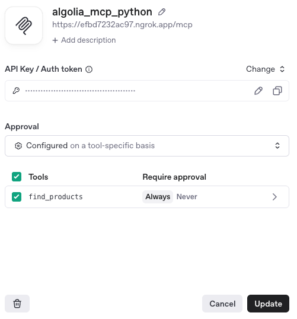
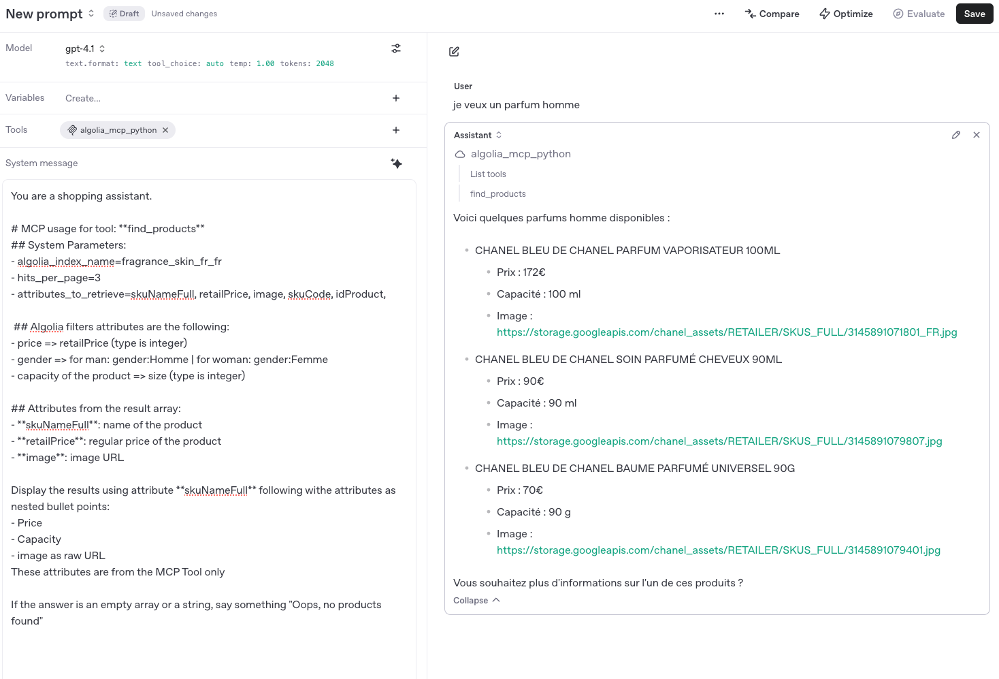

# Run Algolia Search MCP Server on ChatGPT / OpenAI

## Install

```shell
pip install -r requirements.txt
```

## Configuration

Add a .env file in the rood directory of the projet like:

```
MCP_HOST=127.0.0.1
MCP_PORT=8080
MCP_PATH=/mcp
MCP_TRANSPORT=http
MCP_LOG_LEVEL=info
```

## Run

```shell
fastmcp run server.py:mcp
```

# Introspect the MCP Server

```
npx @modelcontextprotocol/inspector
```

You can use it to test the connection with

- Transport Type: `Streamable HTTP`
- URL: `http://127.0.0.1:8080/mcp`

Where host, port and path can be changed in the MCP Server config file (.env)

# Run ngrok for tunneling

```
ngrok http 8080
```

Nb: `8080` can be changed in the MCP Server config file (.env)

It will give you the HTTPS address to allow ChatGPT to connect to your local machine

# Add Algolia Search MCP Server to ChatGPT

1. Go to the ChatGPT Playground for prompts

   [https://platform.openai.com/playground/prompts](https://platform.openai.com/playground/prompts)

2. Add a new tool with the parameters:

- URL: ngrob provided URL + extension **/mcp**.

  Eg. [https://fe8c3a39cc68.ngrok.app/**mcp**](https://fe8c3a39cc68.ngrok.app/mcp)

- Label: **algolia_mcp_python**

  Nb: it could be anything

- Authentication: **None**


3. Connect
   It should list one tool => `find_products`

   

4. Configure the Algolia parameters and index specificity in the

```
You are a shopping assistant.
For the tool "find_products", use parameters:
# algolia_app_id=SPLFJWX0K4
# algolia_api_key=accaba2415019424b77bb418dba08513
# algolia_index_name=fragrance_skin_fr_fr
# hits_per_page=3
# attributes_to_retrieve=skuNameFull, skuCode, idProduct, retailPrice, variantImages.0

In addition, Algolia filters attributes are the following:
## price => retailPrice (type is integer)
gender => for man: gender:Homme | for woman: gender:Femme
## capacity of the product => size (type is integer)

If the answer is an empty array or a string, say something "Oops, no products found"
```

5. Run a User Prompt

```
trouves moi un parfum Homme à moins de 100€

```

Nb: the index is for now in FRENCH



`voilà``
